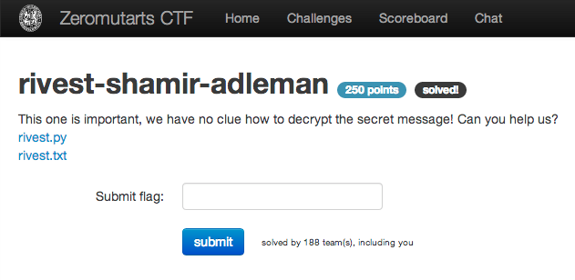

rivest-shamir-adleman
=====================

Flag: **rivest_and_the_cool_gang_would_be_proud**

The challenge flavortext says "This one is important, we have no clue
how to decrypt the secret message! Can you help us?" and links to:

* [rivest.py](rivest.py "rivest.py")
* [rivest.txt](rivest.txt "rivest.txt")

`rivest.txt` is a list of numbers. `rivest.py` is a short Python script that
processes `rivest.txt` and tells us to implement a function that will decrypt
each number.

Given the name of the puzzle and the constants in the script, it is likely that
each number in `rivest.txt` is an RSA-encrypted letter, and putting the
decrypted letters together will give us the flag.

The script gives us `n`, the modulus, and `e`, the public key exponent, but
unlike with the [rsa challenge](../rsa/rsa.md "rsa challenge"), we aren't told
`d`, the private key exponent we need to decrypt the messages:

    n = 80646413
    e = 5
    # You'll have to find the d yourself..
    d = unknown

Recall that d is selected such that `(d * e) % φ(n) = 1`, and `φ(n) = (p - 1) *
(q - 1)`, where `p` and `q` are the prime factors of `n`.

We don't know `p` and `q`, but fortunately `n` is small enough that we can
quickly compute them, even using a very simple algorithm:

    def primes(n):
        d = 2
        while d * d <= n:
            if (n % d) == 0:
                return d, n / d
            else:
                d += 1

    p, q = primes(n)

Now that we have `p` and `q`, we can compute `φ(n)`, and then `d`, using the
`modinv` function supplied in `rivest.py`:

    tot = (p - 1) * (q - 1)
    d = modinv(e, tot) % tot

Now that we have `d`, to recover the plaintext we can compute `m ≡ c^d (mod n)`
using Python's built-in `pow` as we did in the [rsa challenge](../rsa/rsa.md
"rsa challenge"). Here is the solution in full:

    import sys

    ### Given to us in the challenge ###

    n = 80646413
    e = 5

    def xgcd(a,b):
        prevx, x = 1, 0;  prevy, y = 0, 1
        while b:
            q, r = divmod(a,b)
            x, prevx = prevx - q*x, x
            y, prevy = prevy - q*y, y
            a, b = b, r
        return a, prevx, prevy

    def modinv(a, m):
        a, u, v = xgcd(a, m)
        if a <> 1:
            raise Exception('No inverse: %d (mod %d)' % (a, m))
        return u

    ### Our code ###

    def primes(n):
        d = 2
        while d * d <= n:
            if (n % d) == 0:
                return d, n / d
            else:
                d += 1

    def decrypt(c):
        return pow(c, d, n)

    p, q = primes(n)
    tot = (p - 1) * (q - 1)
    d = modinv(e, tot) % tot

    with open(sys.argv[1] , "r") as f:
        message = ""
        for line in f:
            message += chr(decrypt(int(line.strip())))
        print message

Running the script, we get:

    $ python rivest.py rivest.txt
    flag{rivest_and_the_cool_gang_would_be_proud}

The flag is thus `rivest_and_the_cool_gang_would_be_proud`.

[« Return to challenge board](../README.md "Return to challenge board")
